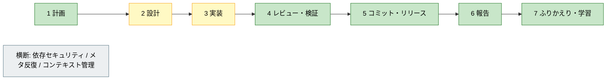
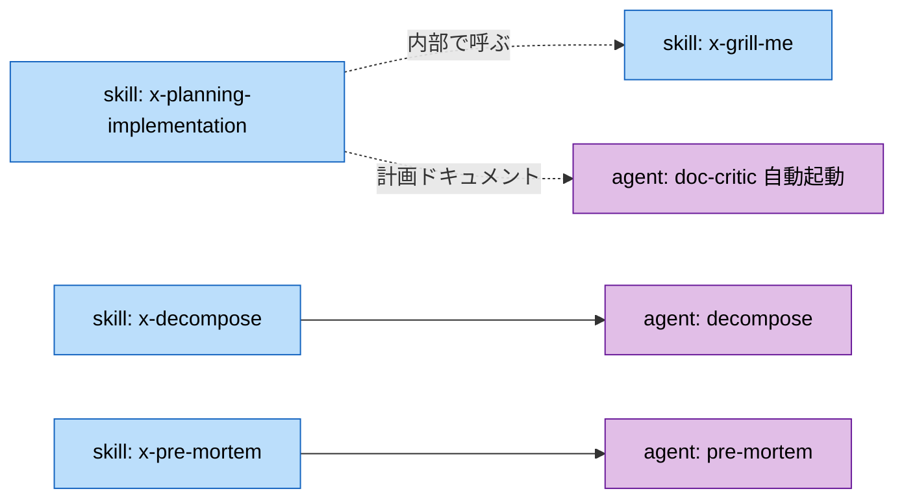
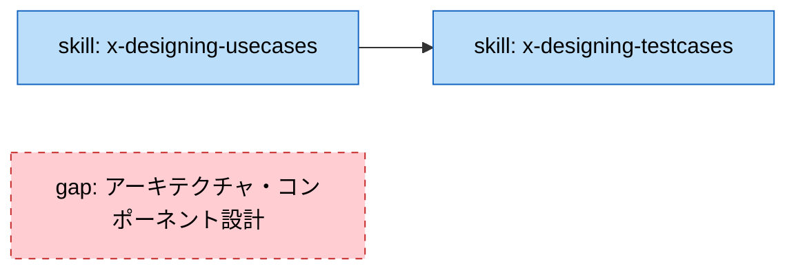
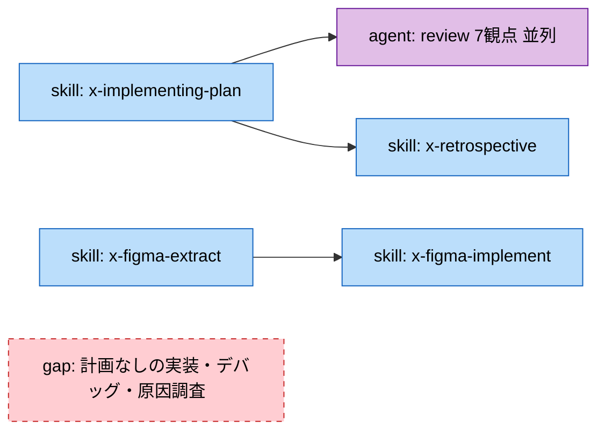
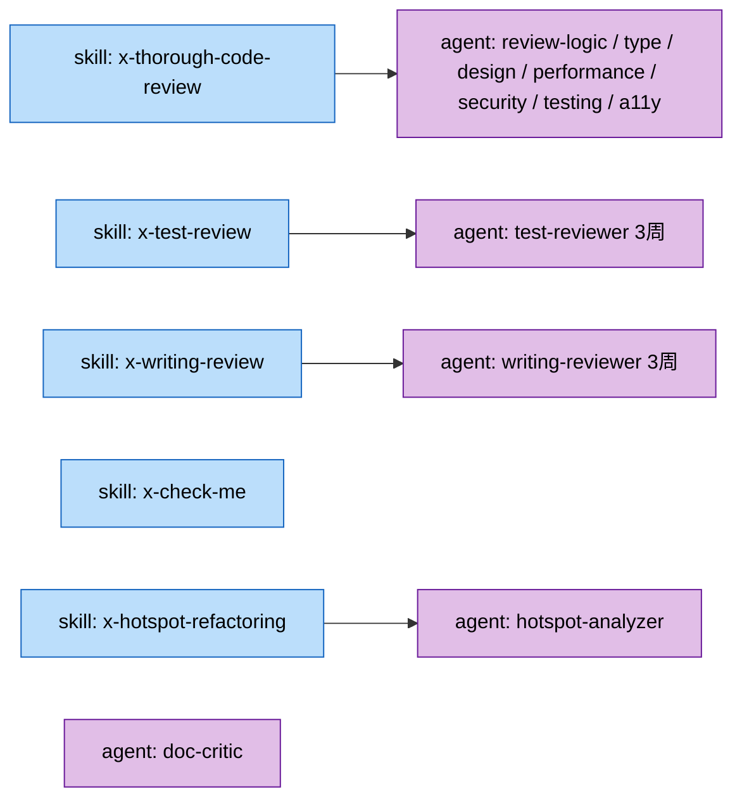
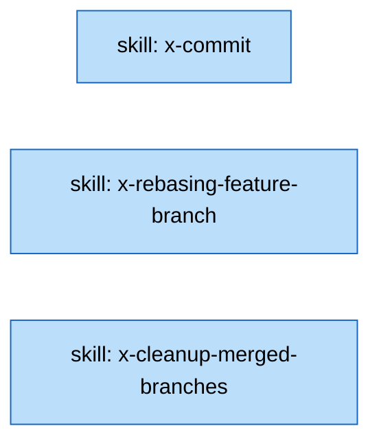
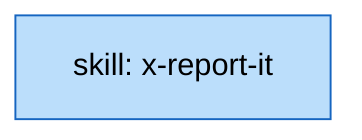
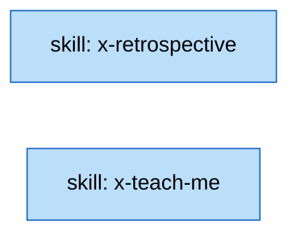
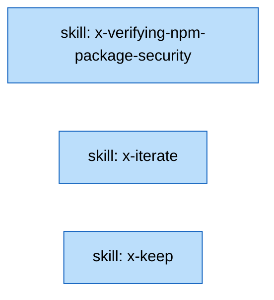

# 制作ワークフローと skill / agent の対応

制作フローを工程に分け、各工程を担うskillとagentをMermaidで示します。工程ごとに「担うskill / agentがあるか、欠けているか」を把握し、フロー全体をエージェントへ委譲できる状態かを判断する材料にします。

図は全体フローと工程別に分けています。1枚にまとめると視覚的に小さくなり読み取りにくくなるためです。

## 凡例

- skillは、ユーザーが明示的に起動するワークフローです（`claude/skills/`）。すべて明示起動専用（`user-invocable-only`）です。
- agentは、skillや他のエージェントから部品として呼ばれる専門処理です（`claude/agents/`）。並列起動・独立コンテキスト・read-only制限に向きます。
- gapは、その工程の処理を担うskillとagentのどちらも存在しない箇所を指します。
- 実線の矢印は処理の流れ、点線の矢印はskillが内部で別のskill / agentを呼ぶ関係を表します。

## 全体フロー（俯瞰）

緑は工程の主要な処理をskill / agentでおおむね担えている工程、黄は担えているものの欠けている処理がある工程です。横断は特定の工程に属さず、フロー全体に関わるskillをまとめています。

## 1 計画

曖昧なタスクを実装計画ファイルへ変換する `x-planning-implementation` を起点に、タスク分解（`x-decompose` → `decompose`）、失敗シナリオの洗い出し（`x-pre-mortem` → `pre-mortem`）、要件の問い詰め（`x-grill-me`）がそろっています。計画ドキュメントを書き上げると `doc-critic` が批判的にレビューする想定です。欠けている処理はありません。

## 2 設計

ユースケース表を作る `x-designing-usecases` から、3層検証へ割り当ててテストコードを生成する `x-designing-testcases` へつながります。一方、アーキテクチャやコンポーネントの構造設計を担うskill / agentはなく、ここが欠けています。

## 3 実装

計画ファイルに沿って実装・検証・レビュー・計画更新・ふりかえりまでを通す `x-implementing-plan` が中心です。レビューでは7観点のエージェントを並列起動し、最後に `x-retrospective` を呼びます。Figmaからの実装は `x-figma-extract` → `x-figma-implement` の連携で担います。計画ファイルを前提としない実装や、デバッグ・原因調査を担うskill / agentはなく、ここが欠けています。

## 4 レビュー・検証

コードレビューは7観点のエージェントを並列起動する `x-thorough-code-review`、テストレビューは `test-reviewer` を3周回す `x-test-review`、文章レビューは `writing-reviewer` を3周回す `x-writing-review` が担います。理解のすり合わせは `x-check-me`、リファクタリング候補の抽出は `x-hotspot-refactoring` → `hotspot-analyzer` です。ドキュメントの批判的レビューは `doc-critic` が担います。検出を担うエージェントが工程内に出そろっています。

## 5 コミット・リリース

論理単位でのコミット作成（`x-commit`）、ベースへのリベース（`x-rebasing-feature-branch`）、マージ済みブランチの整理（`x-cleanup-merged-branches`）がそろっています。git運用はskillで完結し、委譲するエージェントはありません。

## 6 報告

報告相手に推測させない報告文を組み立てる `x-report-it` が担います。PRの説明文の整備もここに含まれます。

## 7 ふりかえり・学習

セッションをKPTA形式で振り返り設定改善まで提案する `x-retrospective`、仕組みを段階的に解説して学習記録を残す `x-teach-me` が担います。

## 横断（工程に属さない）

依存パッケージの追加・更新前に安全性を判定する `x-verifying-npm-package-security`、指定したskillを反復起動する `x-iterate`、`/compact` 前にコンテキストを整理する `x-keep` です。いずれも特定の工程ではなくフロー全体に関わります。

## フロー全体をエージェントに任せられるか

現状は「**工程内は自動化されているが、工程をまたぐ駆動は人の明示起動に依存する**」状態です。

- **工程内の自動化は進んでいます。** レビューの7観点並列化、テスト・文章の3周レビュー、計画・リスク・分解の分析がエージェントへ切り出され、部品として確実に呼べます。
- **工程間の連鎖は一部にとどまります。** `x-planning-implementation` は `x-grill-me` と `x-designing-usecases` を内部で呼びます。`x-designing-usecases` は `x-designing-testcases` へ、`x-implementing-plan` は7観点レビューと `x-retrospective` へつなぎます。ただし計画から実装、実装からコミットへと工程をまたいで進める連鎖はありません。
- **全 skill が明示起動専用です。** 自動で次工程へ進む設計ではないため、フロー全体を1つのエージェントへ任せるには、各skillを順に明示起動する上位オーケストレータ（skillまたはworkflow）が必要です。現状それはありません。
- **欠けている処理があります。** アーキテクチャ・コンポーネント設計（工程2）と、計画ファイルを前提としない実装・デバッグ・原因調査（工程3）を担うskill / agentがありません。フロー全体を任せるには、この2か所を埋めるか、対象外と割り切る判断が要ります。

したがって、フロー全体をエージェントへ丸ごと委譲できる状態ではありません。工程ごとに明示起動して使う前提のもとで、各工程内の繰り返し作業が自動化されている、という整理になります。
